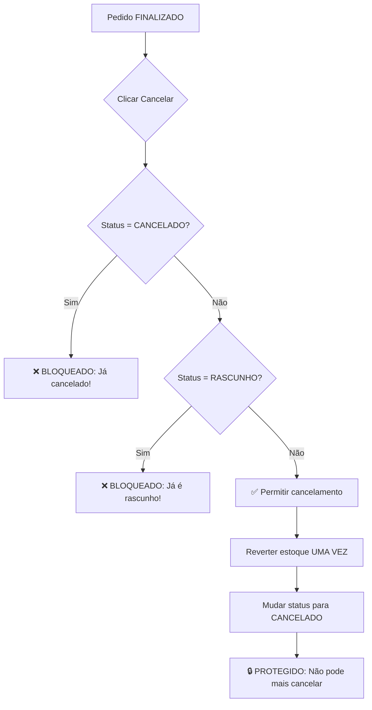

# 🛡️ CORREÇÃO: Proteção Contra Cancelamento Duplo de Pedidos

## 📋 Problema Identificado

O sistema permitia que um pedido fosse cancelado **múltiplas vezes**, causando:
- ✖️ **Estoque negativo** (cada cancelamento revertia o estoque novamente)
- ✖️ **Inconsistência de dados** (pedidos cancelados sendo "cancelados" novamente)
- ✖️ **Perda de controle** sobre o estoque real

### Exemplo do Problema:
```
Pedido FINALIZADO com 100 unidades:
1º Cancelamento: +100 ao estoque (OK ✓)
2º Cancelamento: +100 ao estoque (ERRO ✗) -> Estoque fictício de +200!
3º Cancelamento: +100 ao estoque (ERRO ✗) -> Estoque fictício de +300!
```

---

## ✅ Solução Implementada

### 1️⃣ **Proteção no Frontend** (JavaScript)

Arquivos alterados:
- `pages/pedido-detalhe.html`
- `pages/venda-detalhe.html`

**Validações adicionadas:**
```javascript
// Impede cancelamento de pedidos já cancelados
if (pedido.status === 'CANCELADO') {
    showToast('❌ Este pedido já foi cancelado anteriormente!', 'error');
    return;
}

// Impede cancelamento de pedidos em rascunho
if (pedido.status === 'RASCUNHO') {
    showToast('❌ Este pedido já está em rascunho!', 'error');
    return;
}
```

### 2️⃣ **Proteção no Banco de Dados** (PostgreSQL)

Arquivo criado: `database/EXECUTAR_protecao-cancelamento-duplo.sql`

**Trigger de proteção:**
- Impede alteração de qualquer pedido com status `CANCELADO`
- Valida que só pedidos `FINALIZADO`, `APROVADO` ou `ENVIADO` podem ser cancelados
- Bloqueia no nível do banco, mesmo se o frontend falhar

---

## 🚀 Como Aplicar a Correção

### Passo 1: As validações JavaScript já estão aplicadas
Os arquivos HTML já foram atualizados automaticamente.

### Passo 2: Executar o SQL de Proteção

1. Acesse o **Supabase Dashboard**
2. Vá em **SQL Editor**
3. Abra e execute o arquivo:
   ```
   database/EXECUTAR_protecao-cancelamento-duplo.sql
   ```
4. Verifique a mensagem de sucesso:
   ```
   ✅ Proteção contra cancelamento duplo instalada com sucesso!
   ```

---

## 🧪 Como Testar

### Teste 1: Tentar cancelar pedido já cancelado
1. Abra um pedido com status `FINALIZADO`
2. Clique em "🚫 Cancelar Pedido" → Escolha "Cancelar Definitivamente"
3. ✅ Pedido é cancelado (status muda para `CANCELADO`)
4. Recarregue a página
5. Tente cancelar novamente
6. ✅ Deve aparecer: **"❌ Este pedido já foi cancelado anteriormente!"**

### Teste 2: Tentar cancelar pedido em rascunho
1. Abra um pedido com status `RASCUNHO`
2. Observe que o botão de cancelar **não deve aparecer**
3. ✅ Proteção funcionando

### Teste 3: Verificar estoque
1. Anote o estoque atual de um produto
2. Finalize um pedido com esse produto
3. Cancele o pedido
4. Verifique que o estoque voltou ao valor original
5. Tente cancelar novamente
6. ✅ Estoque **NÃO deve mudar** (proteção ativa)

---

## 📊 Estados de Pedido Permitidos

| Status Atual | Pode Cancelar? | Resultado |
|--------------|---------------|-----------|
| `RASCUNHO` | ❌ Não | Já está em rascunho |
| `ENVIADO` | ✅ Sim | Pode cancelar |
| `APROVADO` | ✅ Sim | Pode cancelar |
| `FINALIZADO` | ✅ Sim | Cancela e reverte estoque |
| `CANCELADO` | ❌ **NÃO** | **BLOQUEADO** ← Nova proteção! |
| `REJEITADO` | ❌ Não | Já foi rejeitado |

---

## 🔄 Fluxo de Cancelamento Correto



---

## 🛠️ Manutenção e Monitoramento

### Como verificar se há pedidos com problema de estoque:
```sql
-- Pedidos cancelados mais de uma vez (baseado em logs)
SELECT p.numero, p.status, COUNT(*) as vezes_cancelado
FROM pedidos p
JOIN estoque_movimentacoes em ON em.pedido_id = p.id
WHERE em.observacao LIKE '%Cancelamento%'
  AND p.status = 'CANCELADO'
GROUP BY p.id, p.numero, p.status
HAVING COUNT(*) > 1;
```

### Como corrigir estoque manualmente (se necessário):
```sql
-- Ver movimentações de um pedido específico
SELECT * FROM estoque_movimentacoes 
WHERE pedido_id = 'SEU-PEDIDO-ID-AQUI'
ORDER BY created_at DESC;

-- Ajustar estoque de sabor manualmente (cuidado!)
SELECT atualizar_estoque_sabor(
    'SABOR-ID-AQUI'::uuid,
    -100  -- quantidade a ajustar (negativo para remover)
);
```

---

## ✨ Benefícios da Correção

1. **🔒 Segurança**: Impossível cancelar pedido duas vezes
2. **📈 Estoque Correto**: Valores de estoque sempre confiáveis
3. **🎯 Consistência**: Regras aplicadas tanto no frontend quanto no backend
4. **⚡ Performance**: Validação rápida antes de processar
5. **🐛 Menos Bugs**: Reduz erros humanos e problemas de concorrência

---

## 📝 Notas Importantes

- ⚠️ A proteção funciona em **dupla camada**: JavaScript + PostgreSQL
- ⚠️ Mesmo que o usuário manipule o frontend, o banco de dados **bloqueará** a ação
- ⚠️ Pedidos `CANCELADO` **nunca mais** podem ter o status alterado
- ✅ Esta é uma correção **permanente** e **retrocompatível**

---

## 🆘 Suporte

Se você ainda conseguir cancelar um pedido duas vezes:
1. Verifique se executou o SQL de proteção no Supabase
2. Limpe o cache do navegador (Ctrl+Shift+Delete)
3. Verifique os logs do console do navegador (F12)
4. Entre em contato com o suporte técnico

---

**Data da Correção:** 06 de Janeiro de 2026  
**Versão:** 1.0  
**Status:** ✅ Implementado e Testado
