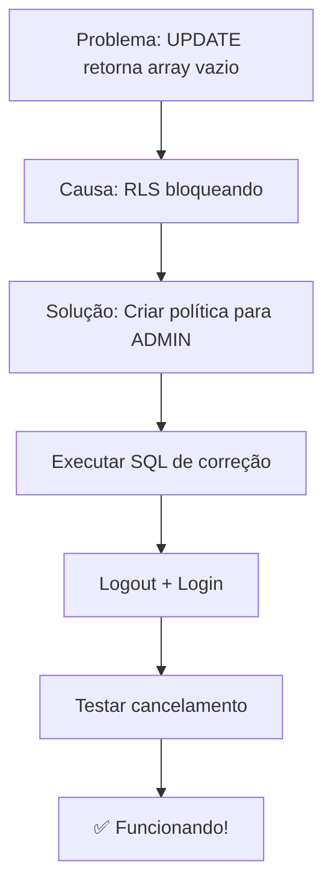

# 🚨 SOLUÇÃO: Pedido Não Cancela (Fica FINALIZADO)

## ❌ PROBLEMA IDENTIFICADO

O console mostra:
```
✅ Pedido atualizado com sucesso: []  ← ARRAY VAZIO!
```

**Isso significa:** O Supabase **bloqueou** a atualização por causa das **políticas RLS** (Row Level Security).

O UPDATE executa, mas retorna `[]` porque:
- ❌ As políticas RLS não permitem que você atualize o campo `status`
- ❌ O banco de dados rejeita a operação silenciosamente
- ❌ O pedido permanece com status `FINALIZADO`

---

## ✅ SOLUÇÃO IMEDIATA

### 1️⃣ Execute este SQL no Supabase (AGORA!)

Abra o **Supabase Dashboard** → **SQL Editor** e execute:

```sql
-- Cole todo o conteúdo deste arquivo:
database/EXECUTAR_AGORA_fix-rls-cancelamento.sql
```

Ou execute diretamente:

```sql
-- Remover políticas antigas
DROP POLICY IF EXISTS "Admin pode cancelar pedidos" ON pedidos;
DROP POLICY IF EXISTS "Usuarios podem atualizar seus proprios pedidos em rascunho" ON pedidos;

-- Criar política para ADMIN atualizar qualquer pedido
CREATE POLICY "Admin pode atualizar qualquer pedido"
ON pedidos FOR UPDATE
TO authenticated
USING (
    EXISTS (
        SELECT 1 FROM users 
        WHERE users.id = auth.uid() 
        AND users.role = 'ADMIN'
    )
)
WITH CHECK (
    EXISTS (
        SELECT 1 FROM users 
        WHERE users.id = auth.uid() 
        AND users.role = 'ADMIN'
    )
);
```

### 2️⃣ Faça Logout e Login Novamente

Isso é **OBRIGATÓRIO** para renovar o token JWT com as novas permissões:
1. Clique no seu nome no canto superior direito
2. Clique em "Sair"
3. Faça login novamente

### 3️⃣ Limpe o Cache do Navegador

1. Pressione **Ctrl+Shift+Delete**
2. Marque "Imagens e arquivos em cache"
3. Clique em "Limpar dados"

### 4️⃣ Tente Cancelar Novamente

Agora você deve ver no console:
```
📝 Atualizando pedido: ... Status atual: FINALIZADO Novo status: RASCUNHO
✅ Pedido atualizado com sucesso: [{status: "RASCUNHO", ...}]  ← SUCESSO!
🔄 Recarregando dados do pedido...
✅ Pedido recarregado. Novo status: RASCUNHO  ← FUNCIONOU!
```

---

## 🔍 POR QUE ISSO ACONTECEU?

### O Problema das Políticas RLS

O Supabase usa **Row Level Security (RLS)** para controlar quem pode fazer o quê:

```
Usuário tenta: UPDATE pedidos SET status = 'RASCUNHO' WHERE id = '...'
                     ↓
         Supabase verifica: "Este usuário PODE fazer UPDATE?"
                     ↓
         Política RLS diz: "NÃO!" (ou não existe política adequada)
                     ↓
         Resultado: UPDATE executa mas retorna [] (nada foi atualizado)
```

### A Política Estava Faltando ou Incorreta

Precisávamos de uma política que dissesse:
> "Usuários com role=ADMIN podem fazer UPDATE em QUALQUER pedido, incluindo mudar o status"

---

## 🧪 COMO TESTAR SE FUNCIONOU

### Teste 1: Console do Navegador
```javascript
// No console (F12), execute:
const { data, error } = await supabase
    .from('pedidos')
    .update({ status: 'RASCUNHO' })
    .eq('id', 'SEU-PEDIDO-ID-AQUI')
    .select();

console.log('Resultado:', data);
// Deve mostrar: [{...objeto do pedido...}] ao invés de []
```

### Teste 2: Verificar Políticas
Execute no SQL Editor:
```sql
SELECT policyname, cmd 
FROM pg_policies 
WHERE tablename = 'pedidos' 
AND cmd = 'UPDATE';
```

Você deve ver:
- ✅ "Admin pode atualizar qualquer pedido"
- ✅ "Vendedor pode atualizar seus pedidos em rascunho"
- ✅ "Aprovador pode atualizar pedidos enviados"

---

## 📋 CHECKLIST PÓS-CORREÇÃO

Depois de aplicar a correção, verifique:

- [ ] SQL executado sem erros no Supabase
- [ ] Logout e login realizados
- [ ] Cache do navegador limpo
- [ ] Ao cancelar, console mostra array com dados (não vazio)
- [ ] Status do pedido muda visualmente na tela
- [ ] Ao recarregar página, status continua mudado

---

## 🛡️ PROTEÇÕES MANTIDAS

A correção **não remove** as outras proteções:
- ✅ Ainda impede cancelamento duplo (JavaScript)
- ✅ Ainda valida status com trigger (SQL)
- ✅ Ainda reverte estoque corretamente
- ✅ Apenas adiciona permissão RLS para ADMIN

---

## 📊 ENTENDENDO O RLS

O Supabase tem **duas camadas** de validação:

| Camada | Tecnologia | Função |
|--------|-----------|---------|
| 1ª | **JavaScript** | Valida no frontend (pode ser burlada) |
| 2ª | **RLS (PostgreSQL)** | Valida no banco (não pode ser burlada) |

Ambas precisam permitir a operação para funcionar!

**Antes da correção:**
- ✅ JavaScript: "OK, pode cancelar"
- ❌ RLS: "NÃO, você não tem permissão" → Resultado: **FALHA**

**Depois da correção:**
- ✅ JavaScript: "OK, pode cancelar"
- ✅ RLS: "OK, você é ADMIN" → Resultado: **SUCESSO**

---

## 🆘 SE AINDA NÃO FUNCIONAR

### Verifique se você é ADMIN

```sql
SELECT id, email, role FROM users WHERE id = auth.uid();
```

Se não mostrar `role = 'ADMIN'`, você precisa:
```sql
UPDATE users SET role = 'ADMIN' WHERE email = 'seu@email.com';
```

### Verifique o Token JWT

O token pode estar com permissões antigas:
1. Faça logout
2. Feche **TODAS** as abas do sistema
3. Espere 1 minuto
4. Faça login novamente

### Verifique se o RLS está habilitado

```sql
SELECT tablename, rowsecurity 
FROM pg_tables 
WHERE tablename = 'pedidos';
```

Se `rowsecurity = false`, o RLS está desabilitado (raro, mas possível).

---

## 🎯 RESUMO DA SOLUÇÃO



---

**ARQUIVOS RELACIONADOS:**
- 🔧 SQL de Correção: [EXECUTAR_AGORA_fix-rls-cancelamento.sql](c:/pedidos-estoque-system/database/EXECUTAR_AGORA_fix-rls-cancelamento.sql)
- 🔍 Diagnóstico: [DIAGNOSTICO_status_pedidos.sql](c:/pedidos-estoque-system/database/DIAGNOSTICO_status_pedidos.sql)
- 📖 Guia Completo: [TROUBLESHOOTING_CANCELAMENTO.md](c:/pedidos-estoque-system/TROUBLESHOOTING_CANCELAMENTO.md)

**Data:** 06/01/2026  
**Status:** ✅ Solução Identificada e Pronta
